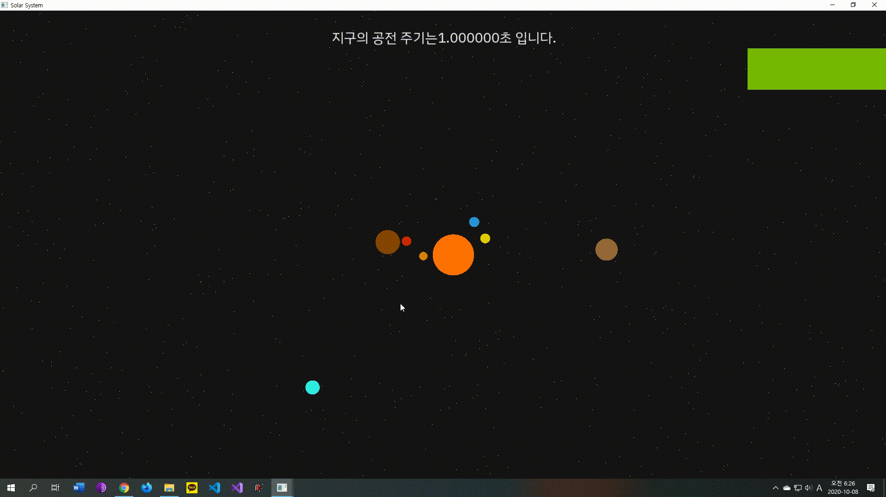
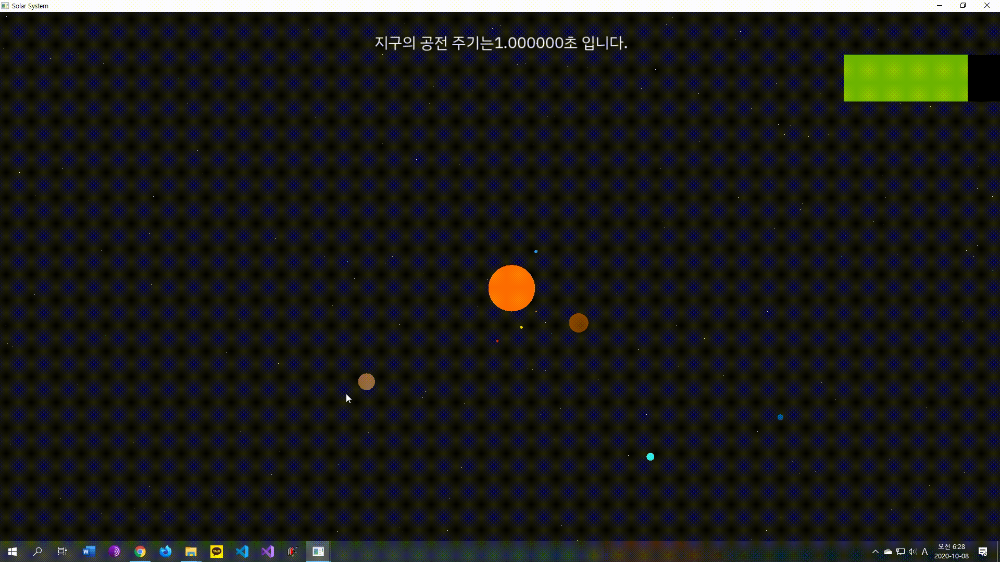

# Solar System 
모든 행성들은 원궤도를 그리며, 천왕성과 해왕성 등 태양으로 부터 거리가 매우 먼 행성들은 임의적으로 그 반지름을 줄였습니다.
위성들은 구현하지 않았으며, 오직 태양계 행성들에 관해서만 작동합니다.

## 구현
원궤도를 구현하기 위해서 ```sin```과 ```cos```을 사용하였습니다.  
그리고 보정을 통해 한층 더 시각적으로 사용자가 감각 할 수 있게 다른 보정변수 k를 넣었습니다.

## 작동

 
공전 속도의 임의적 증감과 행성의 크기 조절을 통해 행성들을 더욱 잘 볼 수 있게 되었습니다.
모든 행성들은 지구의 속성 값을 기준으로 상대적인 값들을 가집니다.



간단히 행성에 대한 정보를 단순히 클릭을 통해서 볼 수 있게 하였습니다. 사용자의 입력을 받는데에 있어서 GLFW에 큰 도움을 받았습니다.  
Space Bar를 누름과 동시에 모든 행성들의 공전이 중지됩니다. 이 상태에서 행성들의 위치를 더욱이 자세히 볼 수 있겠습니다.

## 프로젝트 의의

14일도 채 되지 않는 짧은 여름방학 기간동안 무엇을 하면 의미가 있을까 해서 처음에는 화학책을 폈습니다. 하지만 이것은 너무나도 량이 많아서 간간히 해서 올해 목표로 잡은지 오래였습니다. 그래서 저는 평소에도 관심있던 저의 하늘, 저의 용기, 저의 무력감 모두를 가진 바로 우리 우주에 관련해 저의 특기를 살려 만들어보기를 다짐 했습니다.

우리 은하에 속하는 이 태양계를 구현하기 위해 처음에는 케플러 행성운동법칙에 대해 공부하였지만, 이 상태에서 공전을 구현하려면 미적분을 꼭 배워야만 한다는 사실에 절망했습니다. 물론 배우면 될것이였습니다. 하지만 미적분을 배우게 된다면 이 여름방학에 있어서 스스로 전부를 다 보냈을 것이라고 생각하지 못할것이라고 문득 생각이 나서 원궤도로 구현하는 대신에, 겨울방학때 제대로 물리와 수학을 공부하자고 다짐했습니다.